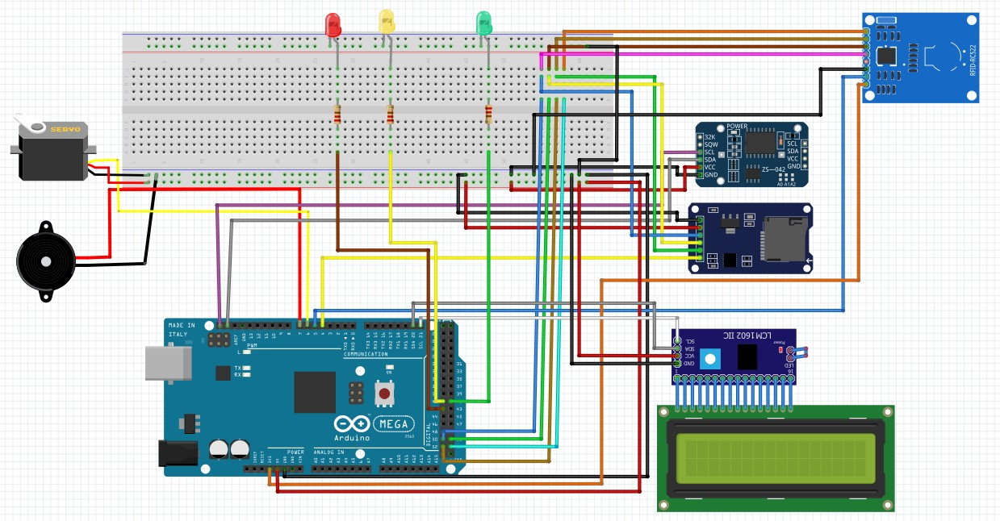
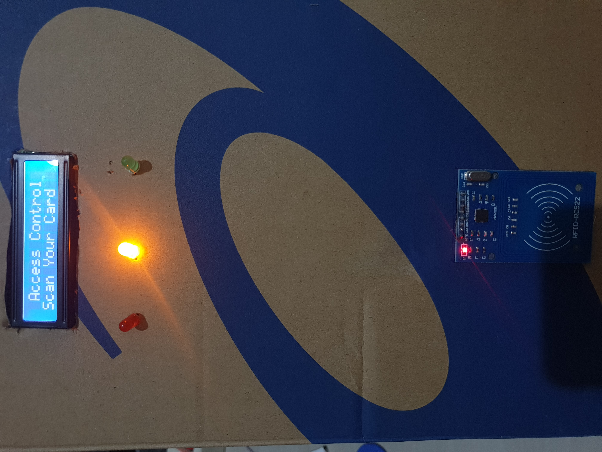
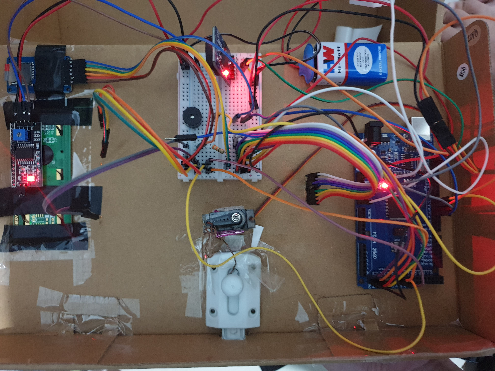

# AUTOMATIC-DOOR-LOCK-SYSTEM-WITH-RFID-SENSOR
Automatic Lock System with RFID Sensor uses microcontrollers as the transmitter and receiver for locking and unlocking a safe box. Input from the device is acquired through an RFID sensor, which accurately scans the unique ID card. If the ID card is the same, the actuator will move.
# Required Components
1. Arduino Mega 2560 or Arduino Uno or ESP32
2. RFID Module
3. Micro Servo
4. Keycard
5. LCD
6. LED light
7. buzzer
8. SD CARD
9. RTC DS3231
10. LCD 1602A I2C
11. Breadboard
# Pin SD CARD
- Arduino Mega-> CS : 4, SCK (CLK): 52, MOSI: 51, MISO: 50, VCC = 5 volt
- Arduino Uno-> CS : 4, SCK (CLK): 13, MOSI: 11, MISO: 12, VCC = 5 volt
# Pin RTC DS3231 and  LCD 1602A I2C
- Arduino Mega-> SCL : SCL, SDA: SDA, Vcc= 5 Volt
- Arduino Uno-> SCL: A5, SDA: A4, Vcc= 5 Volt
# Pin RFID
- Link reference : https://github.com/miguelbalboa/rfid 
- Arduino Mega-> SDA(SS): 53, SCK: 52, MOSI: 51, MISO: 50, RST: 5, Vcc= 3.3 Volt
- Arduino Uno -> SDA(SS): 10, SCK: 13, MOSI: 11, MISO: 12, RST: 9, Vcc= 3.3 Volt
- ESP32       -> SDA(SS): 33, SCK: 18, MOSI: 23, MISO: 19, RST: 13, Vcc= 3.3 Volt
# FLOWCHART

# Design Preview

# Prototype in real world

